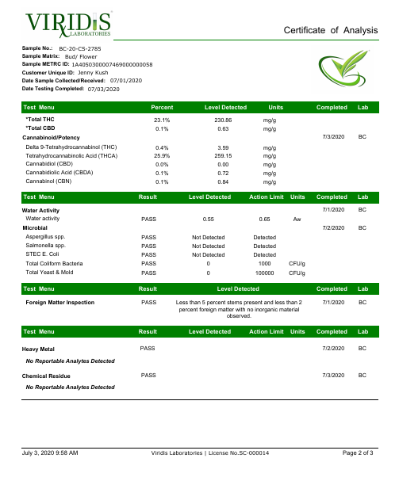
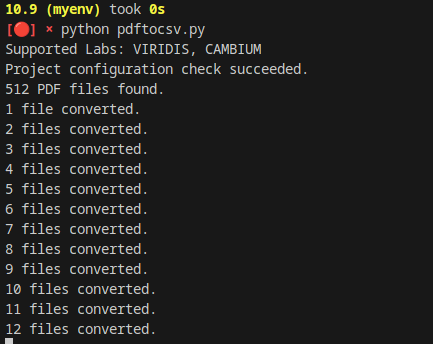
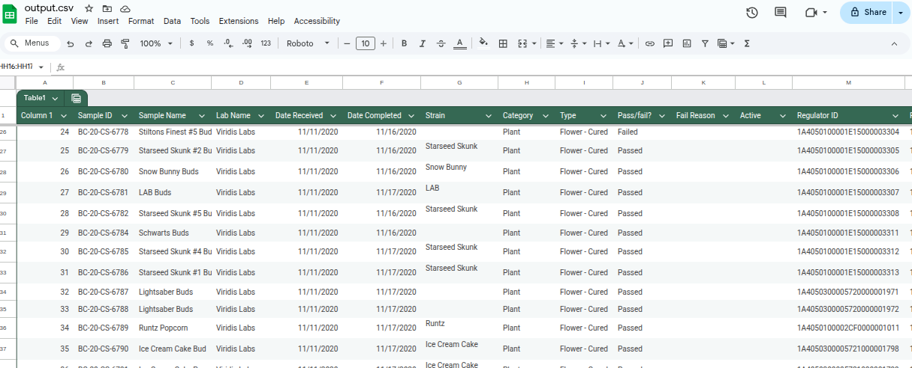

# PDF Certificate of Analysis (COA) to CSV Converter

**Transform raw PDF data into clean, analyzable CSVs — a lightweight Python ETL tool built for speed, accuracy, and dashboard-ready outputs.**  

---

## 🚀 About This Project

This project showcases my ability to build practical Python tools that automate data extraction and transformation tasks — turning messy inputs like scanned PDFs into structured datasets ready for analysis.  

If you need someone who can bridge raw operational data to BI dashboards or machine learning pipelines, I create solutions like this: efficient, reproducible, and business-ready.

---

## Features

✅ Automatically parses COA PDFs  
✅ Outputs consolidated CSV files  
✅ Displays real-time progress  
✅ Lightweight, local, no external services required  
✅ Ideal for integration into ETL pipelines or dashboards  

---

## Installation

### Prerequisites

- **Python 3.10.x**  
- Recommended: **pyenv** for Python version management ([install guide](https://github.com/pyenv/pyenv))

---

## Setup Steps

### 1️⃣ Clone this repository
git clone https://github.com/invisispider/pdf-coa-to-csv.git
cd pdf-coa-to-csv

### 2️⃣ Set the Python version (if using pyenv)
`pyenv install 3.10.9`

`pyenv local 3.10.9`

### 3️⃣ Virtual environment
`python -m venv myenv`

`source myenv/bin/activate`

### On Windows: 
`myenv\Scripts\activate`

### 4️⃣ Install dependencies
`pip install -r requirements.txt`

# Usage

Place your COA PDF files into the input/ directory.

Run the script:

`python pdftocsv.py`

Check the output\ folder for the generated dataframe.csv.

The terminal will display progress as it processes each file.

# Screencaps

### Example lab COA file:

### Using the script from command prompt:

### Generated CSV Example::

# Summary

This project demonstrates:

- Custom Python ETL development

- Automated data extraction from complex file types

- Clean, reproducible, and version-controlled workflows

- Outputs ready for analysis, reporting, or dashboard integration

**🏁 If you need a developer who can design and implement Python solutions for analytics, reporting, and data engineering, this is the kind of work I deliver.**

## 🌐 My GitHub Portfolio

Check out my other highlighted projects:  
- [pdf-coa-to-csv](https://github.com/invisispider/pdf-coa-to-csv) – Python tools that read PDF test certificates  
- [web-scrape-realtors](https://github.com/invisispider/web-scrape-realtors) – Python web scraper for US realtors  
- [mfa-metrc-login](https://github.com/invisispider/mfa-metrc-login) – Automates Metrc MFA login with backup codes  
- [python-google-sheets-server](https://github.com/invisispider/python-google-sheets-server) – Flask server with Google API integration  
- [Stein-Unlimited](https://github.com/invisispider/Stein-Unlimited) – Personal Vue 3 web app with advanced features  
- [invisispider.github.io](https://github.com/invisispider/invisispider.github.io) – My portfolio site on GitHub Pages
